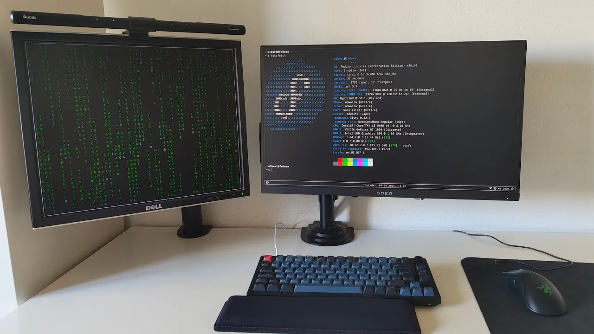

# My Dotfiles

Hey! This repo contains my dotfiles and configurations for **Fedora 42** running **Hyprland**.  

## Showcase

I’ve made a [YouTube video](https://www.youtube.com/watch?v=G9562_gSeG0) where I showcase my setup in action:  

  

Click the image to watch the video!

---

## More Details

The [setup-notes.md](setup-notes.md) contains a collection of problems I’ve run into while using Linux and how I solved each one.

---

## Usage

Feel free to explore, fork, or adapt these dotfiles. They are meant to be simple and easy to use.

